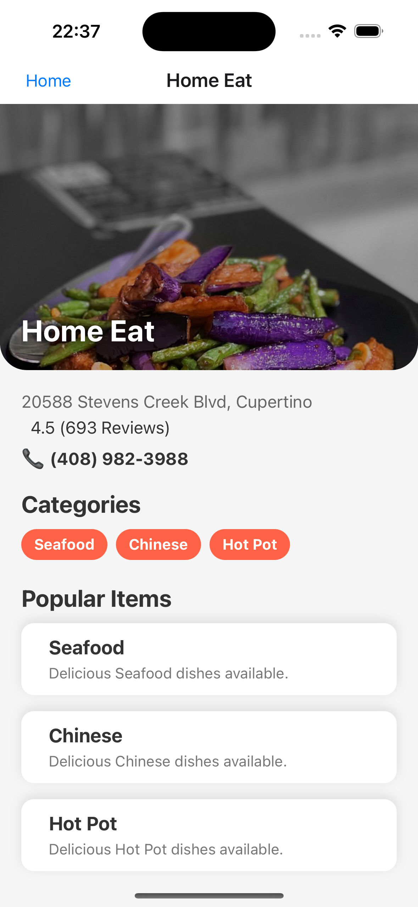

# 🍽️ Food Finder Mobile App

## 🚀 Overview
**Food Finder** is a sleek and intuitive **React Native** mobile application designed to help users effortlessly discover restaurants nearby using the **Yelp API**. The app provides a seamless experience with real-time location-based search, detailed restaurant insights, and a beautifully crafted UI.

---

## 📸 App
<div style="display: flex; justify-content: space-between;">
   
   
</div>

---

## ✨ Features
✅ **Location-based restaurant search** using real-time GPS coordinates  
✅ **Smart search functionality** for finding specific restaurants  
✅ **Comprehensive restaurant details** including ratings, reviews, distance, and price range  
✅ **Modern UI/UX** with smooth navigation and aesthetic gradient headers  
✅ **Card-based restaurant display** for an intuitive browsing experience  
✅ **Real-time distance calculations** from the user's current location  

---

## 🛠️ Tech Stack
🔹 **React Native** (with Expo framework)  
🔹 **Expo Router** (for seamless navigation)  
🔹 **Yelp Fusion API** (for restaurant data integration)  
🔹 **Expo Location** (for fetching user coordinates)  
🔹 **Axios** (for handling API requests)  

---

## 🔧 Installation
### Prerequisites
📌 Ensure you have **Node.js** and **Yarn** installed  
📌 Install **Expo CLI** if not already installed:  
```sh
npm install -g expo-cli
```

### Steps
1️⃣ Clone the repository:  
   ```sh
   git clone https://github.com/yourusername/food-finder.git
   cd food-finder
   ```
2️⃣ Install dependencies:  
   ```sh
   yarn install
   ```
3️⃣ Create a `.env` file in the root directory and add your Yelp API key:  
   ```sh
   EXPO_PUBLIC_YELP_API_KEY=your_key_here
   ```
4️⃣ Start the application:  
   ```sh
   yarn start
   ```
5️⃣ Scan the QR code using **Expo Go** (for iOS and Android) or run it on an emulator.

---

## 🤝 Contributing
1️⃣ **Fork** the repository  
2️⃣ **Create a new branch**: `git checkout -b feature-branch`  
3️⃣ **Commit your changes**: `git commit -m 'Add new feature'`  
4️⃣ **Push to the branch**: `git push origin feature-branch`  
5️⃣ **Open a Pull Request**

---

## 📜 License
This project is licensed under the [MIT License](LICENSE).

---

## 📬 Contact

**Site:** [kijmoshi.xyz](https://kijmoshi.xyz)
